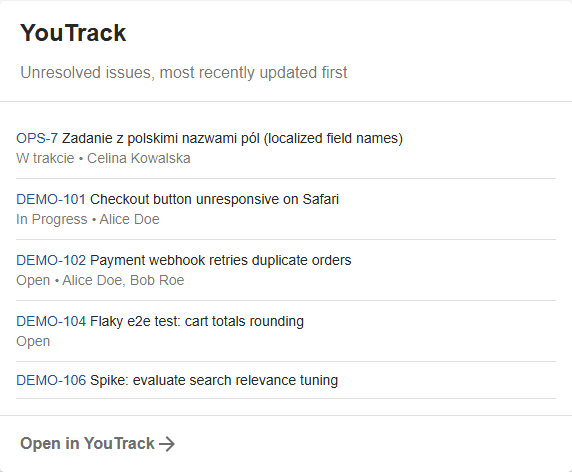
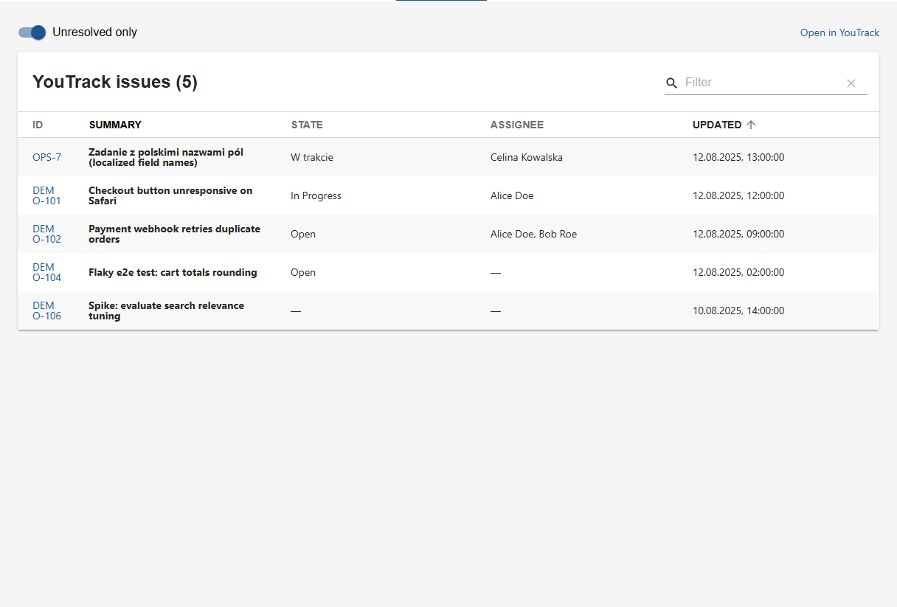

# backstage-plugin-youtrack

Monorepo for [`@jmails/backstage-plugin-youtrack`](./plugins/youtrack) — a Backstage frontend plugin that shows YouTrack issues on catalog entity pages (Overview card + full entity tab), talking to YouTrack exclusively through the Backstage proxy. Works with both the new frontend system (`/alpha` entry point) and the classic one.

**➡ Full installation and configuration docs: [plugins/youtrack/README.md](./plugins/youtrack/README.md)**

## Screenshots

Captured from a scaffolded Backstage app running against the bundled mock (`mock-youtrack/`):

| Overview card (`EntityYouTrackCard`) | Issues tab (`EntityYouTrackContent`) |
| --- | --- |
|  |  |

## Repository layout

```
plugins/youtrack/   # the published package: @jmails/backstage-plugin-youtrack
mock-youtrack/      # dependency-free mock of the YouTrack REST API for interactive testing
.github/workflows/  # CI: typecheck + lint + test + build on PRs, npm publish on v* tags
```

## Development

Requirements: Node 24 (see `.nvmrc`; Node 22 works too), Yarn 4 via corepack.

```sh
yarn install
yarn tsc        # typecheck
yarn test       # jest + React Testing Library + msw (no live YouTrack needed)
yarn build      # backstage-cli package build
```

### Interactive testing without a YouTrack instance

1. Start the mock API: `node mock-youtrack/server.mjs` (listens on `:8090`, serves `GET /api/issues`, asserts a `Bearer` header, honors `query`/`#Unresolved`/`$top`/`$skip`).
2. Scaffold a Backstage app next to this repo: `npx @backstage/create-app@latest` (new frontend system) or `npx @backstage/create-app@latest --legacy` (classic frontend system) — the plugin supports both.
3. Pack the plugin and add the tarball to the app (a `portal:`/`link:` dependency would pull in a
   second copy of React from this repo's `node_modules` — the tarball also matches what npm ships):

   ```sh
   yarn --cwd plugins/youtrack pack --out ../../../my-app/plugin-youtrack.tgz
   # in packages/app/package.json of the scaffolded app:
   #   "@jmails/backstage-plugin-youtrack": "file:../../plugin-youtrack.tgz"
   yarn install
   ```
4. Point the proxy at the mock in `app-config.yaml`:

   ```yaml
   proxy:
     endpoints:
       '/youtrack':
         target: http://localhost:8090/api
         credentials: dangerously-allow-unauthenticated # guest dev app
         allowedMethods: ['GET']
         headers:
           Authorization: Bearer perm:dummy
   youtrack:
     baseUrl: https://example.youtrack.cloud
   ```

5. Wire the plugin into the app — new frontend system: `import youtrackPlugin from '@jmails/backstage-plugin-youtrack/alpha'` and add it to `features` in `App.tsx`; classic: `EntityYouTrackCard` / `EntityYouTrackContent` in `EntityPage.tsx` (see the plugin README). Annotate an example entity with `youtrack.com/tag: svc:example`, and `yarn start`.

There is also a standalone dev app backed by an in-memory fake (no backend/proxy): `yarn --cwd plugins/youtrack start`.

## Releasing

Releases are fully automated and driven by [Conventional Commits](https://www.conventionalcommits.org/): **merging a PR into `master` publishes a new version when there is something to release**.

| Commit / PR title | Result |
| --- | --- |
| `fix: …`, `perf: …` | patch — `0.1.1 → 0.1.2` |
| `feat: …` | minor — `0.1.1 → 0.2.0` |
| `feat!: …`, `fix!: …`, or a `BREAKING CHANGE:` footer | major — `0.1.1 → 1.0.0` |
| anything else (`chore:`, `docs:`, `ci:`, `refactor:`, …) | no release; folded into the next one |

Scopes are fine (`feat(card): …`), matching is case-insensitive, and all commits since the last tag are scanned — the PR title (which GitHub puts into the squash or merge commit) as well as the individual PR commits; the highest bump wins.

A major can also be cut from a **release branch**: branch off as `release/2.0.0`, open a PR and merge it with a *merge commit* (not squash — GitVersion reads the version from the branch name in the merge message); `master` then becomes `2.0.0`.

How it works: [GitVersion](https://gitversion.net) ([GitVersion.yml](./GitVersion.yml)) computes the version from the last `v*` tag and the commits since; the `release` job in [ci.yml](./.github/workflows/ci.yml) injects it into `plugins/youtrack/package.json`, builds, publishes to npm via [Trusted Publishing](https://docs.npmjs.com/trusted-publishers/) (OIDC, no stored token, provenance attached), tags the commit `vX.Y.Z` and creates a GitHub release with generated notes.

Consequences:

- `version` in `plugins/youtrack/package.json` is a placeholder (`0.0.0-development`) — never edit it and never tag by hand; tags are the source of truth.
- The npm Trusted Publisher is registered for the workflow file `ci.yml` (GitHub `jmail/backstage-plugin-youtrack`, no environment) — renaming the file requires updating it on npmjs.com.
- Re-running a failed release is safe: an already-tagged commit is skipped, an already-published version is not published twice.
- Escape hatches: `+semver: none` in the PR title merges a `fix:`/`feat:` without releasing it (it ships with the next release); `[skip ci]` skips the whole workflow, tests included.

Local dry-run of the package contents: `yarn --cwd plugins/youtrack pack --dry-run`.

## License

Apache-2.0
